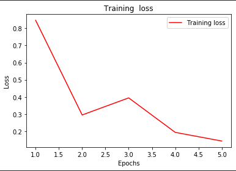
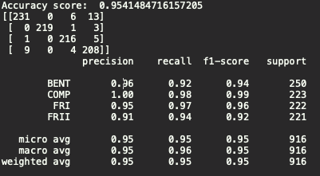

# ResNet50

Found 3660 images belonging to 4 classes.
Found 916 images belonging to 4 classes

Epoch 1/5
114/114 [==============================] - 191s 2s/step - loss: 0.8466 - precision: 0.7686 - acc: 0.7489 - recall: 0.7198 - precision_1: 0.8878            
Epoch 2/5
114/114 [==============================] - 180s 2s/step - loss: 0.3032 - precision: 0.8871 - acc: 0.8987 - recall: 0.8844 - precision_1: 0.9630   
Epoch 3/5
114/114 [==============================] - 176s 2s/step - loss: 0.3938 - precision: 0.9002 - acc: 0.8842 - recall: 0.8929 - precision_1: 0.9349  
Epoch 4/5
114/114 [==============================] - 177s 2s/step - loss: 0.1997 - precision: 0.9384 - acc: 0.9394 - recall: 0.9319 - precision_1: 0.9642  
Epoch 5/5
114/114 [==============================] - 178s 2s/step - loss: 0.1425 - precision: 0.9528 - acc: 0.9531 - recall: 0.9498 - precision_1: 0.9787  

  

